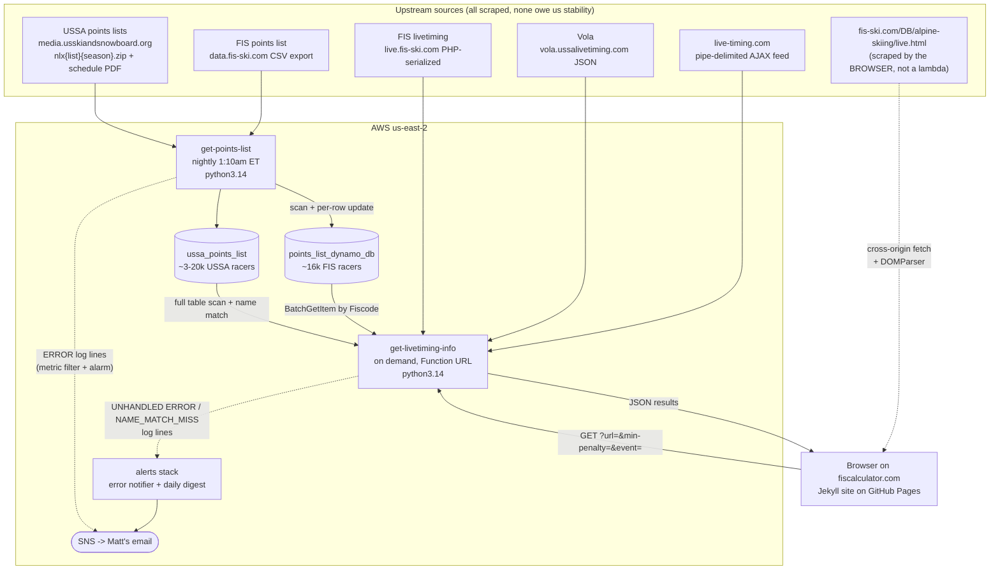

# Architecture

System map for `fis-calculator`, the ski racing points calculator behind
<https://www.fiscalculator.com/>. Read this first; it tells you which of the
sibling docs you actually need.

- [`get-points-list.md`](get-points-list.md) — the nightly ingest lambda
- [`get-livetiming-info.md`](get-livetiming-info.md) — the calculator lambda and its three scrapers
- [`points-calculation.md`](points-calculation.md) — the scoring math
- [`operations.md`](operations.md) — AWS resources, alarms, deploys, runbook
- [`testing.md`](testing.md) — what is tested, how to run it
- [`README.md`](README.md) — index and doc-maintenance rules

## What it does

Ski racers carry FIS or USSA points (lower is better). A race's result produces a
*score* for each finisher, derived from their time relative to the winner plus a
*penalty* computed from the quality of the field. Officially those scores appear
hours or days later. This project computes them live, mid-race, from whatever
the timing provider has published so far.

Two independent halves, plus an alerting stack watching them:

1. **Nightly ingest** — pull the current FIS and USSA points lists into DynamoDB
   so every racer's current points are known locally.
2. **On-demand calculation** — a user pastes a live-timing URL (or picks a race
   off the FIS app list), and the calculator scrapes that race's current state,
   joins each starter to their stored points, and computes scores.
3. **Alerting** (`alerts/`) — emails unhandled calculator errors immediately, and
   digests unmatched-racer misses daily. See [`operations.md`](operations.md).

The two halves share only the DynamoDB tables and deploy separately. Both run
**python3.14** as of Aug 2026 — see [runtimes](#runtimes).

## Data flow



Note the asymmetry in the two reads from DynamoDB: FIS-livetiming races supply
fiscodes so the lookup is a keyed `BatchGetItem`; Vola and USSA races supply only
names, forcing a **full table scan plus fuzzy name matching**. That is the single
biggest performance and correctness risk in the request path.

## Repo layout

**The Jekyll site is rooted at the repo root, not in `website/`.** `website/`
holds only static assets. This trips people up constantly.

```
/                        Jekyll site root
  index.html             the calculator page (form + FIS-app race table)
  about.html
  privacy-policy.html
  _layouts/default.html  wraps every page
  _includes/             head.html, header.html, footer.html
  _config.yml            ONLY an exclude list - see below
  CNAME                  www.fiscalculator.com
  ads.txt                Ezoic/AdSense
  website/               ASSETS ONLY: app.js, styles.css, images/
  docs/                  these files
  get-points-list/       SAM app - nightly ingest
    src/                 app.py, fis_points_download.py, ussa_points_download.py
    tests/               real pytest suite (see testing.md)
    template.yaml
  get-livetiming-info/   SAM app - the calculator
    src/                 app.py, scrapers.py, utils.py, exceptions.py
    tests/               dead hello-world boilerplate
    template.yaml
  alerts/                SAM app - error emails + daily name-match digest
    src/                 error_notifier.py, digest.py
    template.yaml        the ONE template that matches what is deployed
```

### Directories to never read

These will actively mislead you:

| path | why |
|---|---|
| `get-livetiming-info/_site/` | **a stale copy of `src/`.** All three modules differ from live `src/`. Reading it will give you wrong line numbers and wrong logic. |
| `_site/`, `.jekyll-cache/` | Jekyll build output, untracked |
| `.aws-sam/` | SAM build output |

## The website

**Hosting:** GitHub Pages, custom domain via `CNAME`. No CI workflow, no
`Gemfile`, no build step of our own — **push to `main` and it deploys.** Pushing
main therefore republishes the site, which matters when committing lambda-only
changes.

**`_config.yml` contains only an `exclude:` list.** No baseurl, no plugins —
Jekyll otherwise runs on pure defaults, which is why every asset reference is a
bare relative path (`website/app.js`, `website/styles.css` in
`_includes/head.html`) rather than `{{ site.baseurl }}/...`. Don't "fix" this
casually; the relative paths work precisely because there is no baseurl.

The exclude list exists because without one **Jekyll copies the entire repo into
the published site** — both lambdas' Python source was being served from the live
domain (`/get-livetiming-info/src/app.py` returned 200 with real source). Adding
it took the build from 62MB to 184K. Two things to remember:

- Jekyll's `exclude` **replaces** its built-in list rather than extending it, so
  the defaults worth keeping (`Gemfile`, `node_modules/`, `vendor/`) are re-listed
  in the file.
- **Any new top-level directory that isn't part of the site must be added there**,
  or it gets published.

To verify a site change without installing Jekyll:

```bash
docker run --rm -v "$PWD":/srv/jekyll -v /tmp/out:/out \
  --entrypoint /bin/sh jekyll/jekyll:4 -c 'cd /srv/jekyll && jekyll build --destination /out'
```

then diff `/tmp/out` against the previous `_site/`. Note `privacy-policy.html:7`
renders `{{ site.time }}`, so its "Last updated" date is the **build** date and
shifts on every rebuild regardless of whether the policy changed.

**Warm-up:** `_includes/head.html:1` preloads
`https://hsa35mz4zsbu6nqwlb5jvkk4o40jruqd.lambda-url.us-east-2.on.aws/?url=preload`
so the first real submit doesn't eat a cold start. The lambda short-circuits
`url=preload` before it does any logging.

**Third-party tags** in `head.html`: GA `G-MPPN8PSV80`, AdSense
`ca-pub-8361932805710998`, Grow.me, and Ezoic (currently commented out).

### The form

`index.html:33-53`. Three required fields:

| field | id | notes |
|---|---|---|
| URL or codex | `#urlInput` | a live-timing.com URL, a Vola URL, a `fis-ski.com/...lv-al<codex>` URL, or a bare FIS codex |
| race level | `#minPenalty` | value is a **`"minPenalty,adder"` pair**, split server-side |
| event | `#eventSelector` | `SLpoints` / `GSpoints` / `SGpoints` / `DHpoints` |

The race-level values encode two numbers in one option:

```
USSA                   -1,0     <- -1 is a sentinel, not a real penalty
Open FIS               23,8
National Championship  20,8
Noram/Europa Cup       15,0
Entry League           60,8
World Cup               0,0
Citizen                40,8
```

`-1` means "this is a USSA race": the lambda detects it at `app.py:240` with a
**string** comparison (`min_penalty < "0"`), then forces min penalty 40 and
`is_fis_race=False`. The `adder` drives the projected next-season score.

Validation is thin: HTML5 `required` plus an empty-check at `app.js:115-117` that
silently returns. A fuller `validateForm()` sits commented out at `app.js:450-476`.

**Known wart:** the request URL at `app.js:122-124` is built with a multi-line
template literal, so literal newlines and indentation are embedded in the query
string before `&min-penalty` and `&event`. It works only because the whitespace
lands inside the preceding value and the backend tolerates it.

### Two entry paths

**Path A — pick a live race off the FIS app list.** `app.js:318` does a
**cross-origin fetch of `https://www.fis-ski.com/DB/alpine-skiing/live.html`
from the user's browser**, then parses it with `DOMParser`. Clicking a row
autofills all three form fields from row attributes and auto-submits
(`app.js:364-372`).

This scrape is brittle in three ways worth knowing before you debug it:

- **Positional indices** into `.split-row__item`: `[1]` codex, `[2]` location,
  `[5]` category, `[6]` event (`app.js:328-334`). Plus the class names `.g-row`,
  `.timezone-date`, `.country__name-short`, `.gender__item`, `.live__content`.
  Any FIS restyle breaks it.
- **No `.catch()`** on the fetch chain. A failure leaves the loader spinning
  forever with no error shown.
- Two lookup tables must stay in sync with the form dropdown:
  `raceCategoryToPenalty` (33 FIS category codes → penalty pairs,
  `app.js:275-306`) and `eventNameToCategory` (keyed on FIS's English display
  strings — "Slalom", "Giant Slalom", "Super G", "Downhill", "Downhill
  Training", `app.js:307-313`). An unknown category yields `undefined` with no
  fallback; parallel and team events are unmapped.

**Path B — manual entry.** Paste a live-timing or Vola URL, or a codex, choose
level and event, submit.

### Rendering

`app.js:126-269` builds a table from scratch. Column set varies by mode
(`createTableHead`, `app.js:32-90`):

| mode | columns |
|---|---|
| startlist | Pl, Name, Points |
| speed (SG/DH) | Pl, Name, R1, Points, Score |
| projections | Pl, Name, R1, Projected Total, Points, Projected Score |
| 3-run SL | Pl, Name, R1, R2, R3, Total, Points, Score |
| normal | Pl, Name, R1, R2, Total, Points, Score |

Scores beating the racer's current points get class `personal-best`, with opacity
scaled by `calculatePersonalBestColor` (`app.js:25-30`, darkest at a 25%
improvement). If some racers' points weren't found, a "results might be off,
points not found for:" warning is prepended (`app.js:145-152`). Results
`scrollIntoView` on completion.

### The seasonal "2027 Score" column

FIS races get an extra column projecting next season's score (same math with the
`adder` applied). **The season is hardcoded in two places that must be bumped
together:**

- `website/app.js:84` — the literal `<th>2027 Score</th>`
- `get-livetiming-info/src/app.py:276` — the response key `score2027`

`app.js:231, 244-248, 254` also reference the `score2027` key. See
[`operations.md`](operations.md) for the rest of the seasonal checklist.

## DynamoDB

Two tables, both in us-east-2, **neither managed by CloudFormation** — they were
created by hand and predate the templates.

| table | contents | written by | read by |
|---|---|---|---|
| `points_list_dynamo_db` | FIS racers | FIS half of the ingest | FIS races |
| `ussa_points_list` | USSA racers | USSA half of the ingest | USSA races |

Selected at `get-livetiming-info/src/utils.py:27` purely on `race.is_fis_race`.

**Schema:** partition key `Fiscode` (String), no sort key.

```
Fiscode        S   "10001636"        <- string, even though the CSVs carry ints
Lastname       S   "SALA"
Firstname      S   "Tommaso"
Competitorname S   see below
DHpoints       N   Decimal
SLpoints       N   Decimal
GSpoints       N   Decimal
SGpoints       N   Decimal
ACpoints       N   Decimal
```

### The sentinel asymmetry — read this before debugging points

Three different "no points" values are in play, and they do not line up:

| value | meaning | where |
|---|---|---|
| `-1` | stored in DynamoDB, racer has no points in this discipline | written by the FIS ingest (NaN → -1) |
| `999.99` | in-memory "unscored", also **stored directly by USSA** | `utils.py:137/188/218` converts `-1` → `999.99` |
| `1000` | default on a fresh `Competitor`, meaning "not found in the DB at all" | `scrapers.py:19` |

The trap: **USSA CSVs already contain `999.99`**, so the `points == -1 → 999.99`
conversion never fires for USSA racers. FIS racers reach `999.99` via the
conversion; USSA racers arrive there directly. This matters because
[`points-calculation.md`](points-calculation.md) has a rule that overrides the
minimum penalty when three or more of the top five sit at `999.99` — it triggers
far more readily on USSA races.

### The name-based join

`Competitorname` means **two different things** depending on the table:

- FIS: the raw value from the FIS CSV, e.g. `"SALA Tommaso"`
- USSA: a **sorted-character anagram key** — lowercase, strip non `a-z`, sort the
  characters. `"Reagan Abbott"` → `"aaabbegnortt"`

That key is generated by three separate copies of the same function
(`utils.preprocess_name`, `scrapers.generate_ussa_competitor_name`,
`ussa_points_download.generate_competitor_name`).

Consequences, all of which live in `get-livetiming-info/src/utils.py`:

- Only FIS livetiming supplies fiscodes → keyed `BatchGetItem` in 100-key pages.
- Vola and USSA races **scan the whole table** and match on the anagram key, with
  `ProcessedName` recomputed *inside* the per-competitor loop (`utils.py:109`) —
  O(n²), and the main risk of hitting the 120s timeout on a big field.
- Anagram collisions are possible by construction.
- Unmatched racers are patched via a hand-maintained `NAME_ERROR_FISCODES` dict
  (`utils.py:16-22`) that grows every season. Note `utils.py:124-125` tests
  membership with the *unprocessed* name but indexes with the *processed* one, so
  it can `KeyError`.
- `OLD_vola_fis_add_points_to_competitors` (`utils.py:142`) is dead code.

## Runtimes

| lambda | runtime | packaging |
|---|---|---|
| `get-points-list` | **python3.14** | deps bundled in the zip, ~46MB, no layers |
| `get-livetiming-info` | **python3.14** | deps bundled in the zip, ~47MB, no layers |

Both moved to 3.14 in Aug 2026, and both pin `pandas>=2.3.3,<3` — 2.3.3 is the first
release with cp314 wheels, and pandas 3.x changes copy-on-write and the default string
dtype, which neither lambda has been checked against.

Removing pandas from the calculator is still worth doing: it uses it for almost nothing
(a DataFrame, one `to_numeric`, boolean masks, `.iloc`) and dropping it would cut cold
start and force a fix to the O(n^2) name matching. It was never a blocker for the
runtime, though — see [`get-livetiming-info.md`](get-livetiming-info.md).
